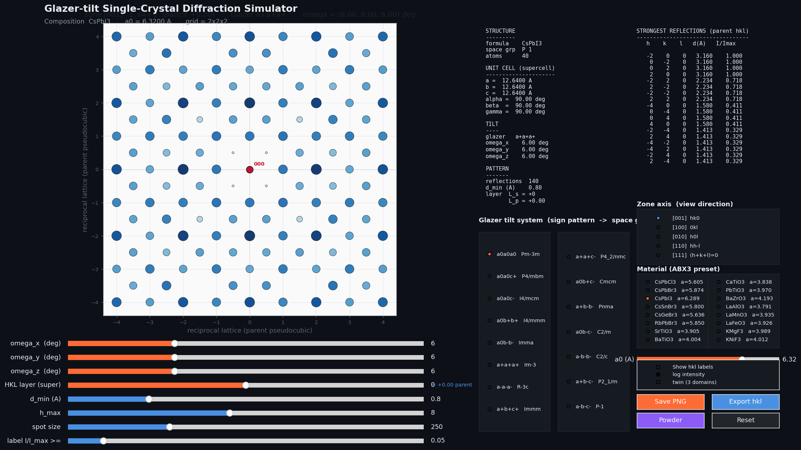
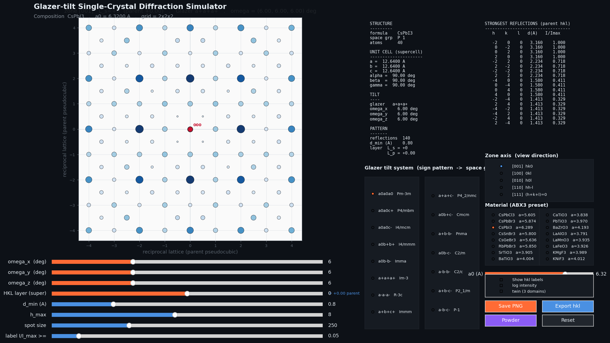
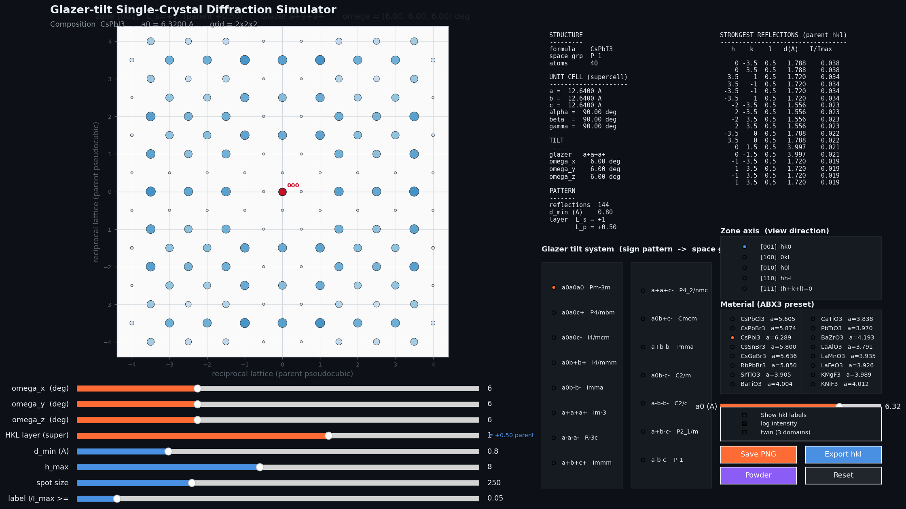
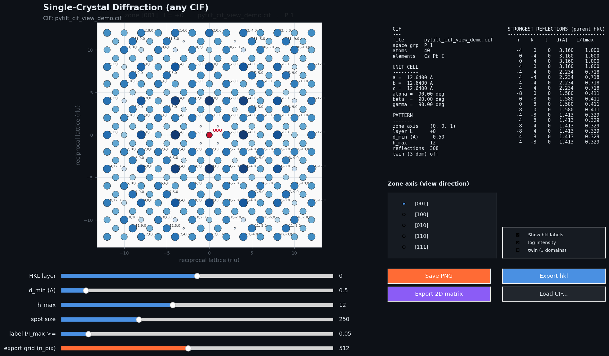

# pytilt-diffraction

Interactive single-crystal X-ray diffraction simulator for perovskites with
tunable Glazer octahedral-tilt systems. A matplotlib GUI that lets you pick a
tilt pattern and watch the reciprocal-space pattern
update as you drag the tilt-angle sliders, switch zone axes, or step through
HKL layers.

The 15 distinct tilt systems exposed in the GUI are the
group-subgroup tree of Howard & Stokes (1998) -- the subset of Glazer's (1972)
23 patterns:

![Howard-Stokes 15 tilt systems]


Built on top of the [pytilting](https://gitlab.com/pyseries/pytilting)
tilt-generator (vendored under `vendor/pytilting/`, GPL v2). The structure
factor / `F(hkl)` engine and the GUI are original.

**References**

- Glazer, A. M. (1972). *The classification of tilted octahedra in
  perovskites*. Acta Cryst. **B28**, 3384-3392.
- Howard, C. J. & Stokes, H. T. (1998). *Group-Theoretical Analysis of
  Octahedral Tilting in Perovskites*. Acta Cryst. **B54**, 782-789.

## Install

```bash
git clone <this-repo-url>
cd pytilt-diffraction
pip install -e .
```

The pytilting tilt generator is already bundled in `vendor/pytilting/`.

## Run

```bash
python -m pytilt_diffraction.simulator
# or, after install:
pytilt-gui
```


## Screenshots

CsPbI3 with `a+a+a+`, alpha = 6 deg, zone [001], L = 0 (parent rlu).

| log intensity | linear intensity |
|---|---|
|  |  |

Half-integer parent layer (`L_super = 1`, equivalent to L = 0.5 in the
parent pseudocubic cell). The 2x2x2 supercell doubles the reciprocal-
lattice spacing along each axis, so odd `L_super` slices fall *between*
the parent Bragg peaks -- a slice where every visible peak is a
superlattice reflection produced by the octahedral tilts:



**Intensity encoding:** marker color (white -> dark blue, `Blues`
colormap) and marker size both scale with reflection intensity --
darker and bigger = stronger. Linear mode applies a mild gamma compression so
weak peaks stay visible alongside the dominant Bragg reflections; log
mode uses log-stretched intensities directly.

## Generic CIF viewer

If you just want single-crystal diffraction from an arbitrary CIF (no
Glazer / tilt machinery, no perovskite assumption), there's a separate
GUI built on the same `DiffractionCalculator`:

```bash
python -m pytilt_diffraction.cif_viewer path/to/structure.cif
# or, with no path -> file picker
python -m pytilt_diffraction.cif_viewer
```

Same controls as the Glazer simulator (zone axis, HKL layer slider,
d_min, h_max, log/linear, twin (3 domains), labels), plus:

The HKL layer slider works for every zone axis -- not just [001]. It
sets the integer constant `L` in the zone-law `h*u + k*v + l*w = L`,
so:

  - zone [001]: layer L  =>  hk-plane at l = L
  - zone [100]: layer L  =>  kl-plane at h = L
  - zone [110]: layer L  =>  diagonal slice  h + k = L
  - zone [111]: layer L  =>  diagonal slice  h + k + l = L

The plot title prints the explicit zone-law constraint so it's
unambiguous which slice you're looking at.


- **Save PNG**       -- the current pattern.
- **Export hkl**     -- `(h, k, l, d, |F|, I, I_norm)` table as `.txt`.
- **Export 2D matrix** -- rasterise the visible slice as a regular
  `n_pix x n_pix` array of summed Gaussians, written as both
  `.npy` and `.csv` (plus a `*_meta.txt` describing the extent and
  shape). Use this to compare side-by-side with experimental detector
  images, or feed it to MATLAB / Origin / Igor.



The matrix-export grid resolution is controlled by the `export grid
(n_pix)` slider at the bottom (64 to 1024 pixels per side).

## Web app (Streamlit)

**Live demo (no install required):**

- Glazer simulator: <https://pytilt-diffraction-milos.streamlit.app/>
- CIF viewer (upload a `.cif`):
  <https://pytilt-diffraction-milos.streamlit.app/CIF_viewer>

A browser version of both modes lives in `streamlit_app.py` (Glazer
simulator) and `pages/2_CIF_viewer.py` (CIF upload). They share the
same `DiffractionCalculator`; only the widget layer is Streamlit.

```bash
pip install -r requirements.txt
streamlit run streamlit_app.py
```

Streamlit picks up `pages/` automatically, so you'll see two entries in
the left-hand sidebar nav: the Glazer simulator (default) and the CIF
viewer (drag-and-drop a `.cif`, with the same hkl / matrix downloads
as the desktop GUI).

The live demo is deployed via [share.streamlit.io](https://share.streamlit.io)
and auto-redeploys on every push to `main`.

## Controls

- **Glazer tilt system** (radio, two columns): the 15 distinct tilt
  systems of Howard & Stokes (1998), labelled with the standard
  hettotype space-group symbol. (Glazer (1972) listed 23 patterns;
  Howard & Stokes showed 8 of these are crystallographically equivalent
  to others, leaving 15.)
- **omega_x / omega_y / omega_z** (sliders): tilt magnitudes in degrees.
  Magnitudes that the Glazer letters demand equal are kept tied automatically.
- **HKL layer** (slider): integer L index in the supercell reciprocal
  lattice -- selects which constant-L slice through reciprocal space the
  pattern shows. For the default 2x2x2 supercell, `L_super = 1` corresponds
  to L = 0.5 in the parent pseudocubic cell (the R-point / superlattice
  layer).
- **Zone axis** (radio): view direction of the reciprocal-space slice.
- **Material** (radio, two columns): 16 ABX3 perovskite presets covering
  halides (CsPbCl3, CsPbBr3, CsPbI3, CsSnBr3, CsGeBr3, RbPbBr3), oxides
  (SrTiO3, BaTiO3, CaTiO3, PbTiO3, BaZrO3, LaAlO3, LaMnO3, LaFeO3), and
  fluorides (KMgF3, KNiF3). Picking a preset swaps the basis and snaps the
  lattice constant to the high-temperature cubic aristotype value. The
  tilt, zone, and layer selections are preserved.
- **a0** (slider, 3.0 - 7.5 A): fine-tune the cubic lattice constant without
  changing the composition. Useful for temperature / composition sweeps
  around a given preset.
- **d_min / h_max / spot size / label threshold** (sliders): viewing
  parameters.
- **Powder** (button): open a side window with a kinematic powder pattern
  for the current composition, lattice, and tilt. Picks Cu / Mo / Co / Cr /
  Ag K-alpha wavelengths, with sliders for 2theta range, h_max, and peak
  FWHM. Updates automatically when you touch the main window.
- **Save PNG / Export hkl / Reset**: export buttons flash a confirmation
  banner at the top of the window; files land next to the script.

## Package layout

```
pytilt-diffraction/
    pytilt_diffraction/
        __init__.py
        calculator.py   # CIFParser + DiffractionCalculator + rasterize_plane
        simulator.py    # Glazer GUI (perovskite + tilt sliders)
        cif_viewer.py   # generic CIF GUI (any structure)
    streamlit_app.py    # Streamlit: Glazer mode (default page)
    pages/
        2_CIF_viewer.py # Streamlit: CIF upload mode (sidebar nav)
    vendor/
        pytilting/      # upstream Glazer-tilt generator, vendored (GPL v2)
    tests/
        test_physics.py
        test_diffsims_parity.py
    examples/
    docs/
        screenshots/    # PNGs referenced by README
    pyproject.toml
    README.md
    LICENSE
```

## Licensing

This project depends on and redistributes **pytilting**, which is GPL v2.
Accordingly, this project is distributed under **GPL v2 or later** (see
`LICENSE`). Any redistribution must preserve `vendor/pytilting/LICENSE`.

## Validation

The `DiffractionCalculator` has been cross-checked against
[diffsims](https://github.com/pyxem/diffsims) (pyxem's X-ray / electron
diffraction simulation package). We compute F(hkl) with our Cromer-Mann
parameterisation and compare against diffsims'
`get_kinematical_atomic_scattering_factor` (Doyle-Turner 1968 table) with an
explicit atomic sum, over a 7-material / 11-hkl grid:

- **Halides**: CsPbCl3, CsPbBr3, CsPbI3
- **Oxides**: SrTiO3, BaTiO3, LaAlO3
- **Fluorides**: KMgF3

Across 77 reflections the magnitude agreement is typically under 1% and
always under 5% (absolute slack 0.15 for near-zero structure factors), and
the top-5 strongest reflections match ordering for every material. The
residual comes from the two different form-factor parameterisations, not
from the summation. Our calculator is also ~3x faster per reflection than
diffsims' form-factor path with the same summation (37 us vs 117 us on
cubic CsPbBr3).

Tests and timings: `tests/test_diffsims_parity.py`, `tests/test_physics.py`,
and `tests/BENCHMARK.md`.

```bash
pip install diffsims pytest
python -m pytest tests/ -q
```

A footnote on diffsims 0.7.0: its top-level `get_kinematical_structure_factor`
has a bug in `find_asymmetric_positions` that silently drops all but the
first asymmetric-unit atom. We therefore compare form-factor
parameterisations by summing over atoms ourselves, which is the fair
comparison. See `tests/BENCHMARK.md` for details.
